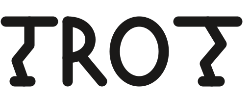

<p align="center">
  <picture>
    <source media="(prefers-color-scheme: dark)" srcset="logo_dark.svg">
    <source media="(prefers-color-scheme: light)" srcset="logo_light.svg">
    
  </picture>
</p>

_Trotter-propagated Random Orbital Trajectories_

An end-to-end differentiable Auxiliary Field Quantum Monte Carlo (AFQMC) code based on Jax.

## Usage

The code can be installed as a package using pip:

```
  pip install .
```

For use on GPUs with CUDA, install as:

```
  pip install .[gpu]
```

CPU calculations are only parallelized with multithreading (no MPI).

This code is interfaced with pyscf for electronic integral evaluation. Examples can be found in the examples/ directory.
